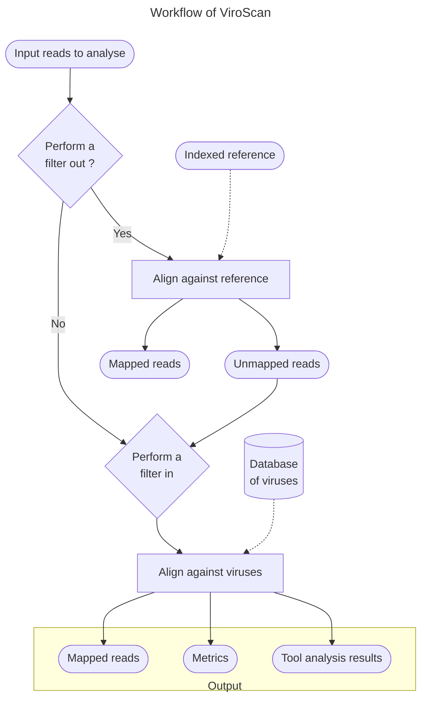

<h2>ViroScan</h2>  

ViroScan is an automated pipeline that eliminate short-reads not of interest according to a reference (filter-out) and identify viruses present (filter-in).

## Table of Contents

   * [Foreword](#foreword)
   * [Installation](#installation)
      * [ViroScan](#viroscan)
      * [Nextflow](#nextflow)
      * [Container platform](#container-platform)
        * [Docker](#docker)
        * [Singularity](#singularity)  
   * [Usage and test](#usage)
   * [Parameters](#parameters)
   * [Uninstall](#uninstall)
   * [Contributing](#contributing)
   * [Report bugs and issues](#report-bugs-and-issues)
   * [How to cite?](#how-to-cite)
   * [Acknowledgement](#acknowledgement)

## Foreword

ViroScan is an automated pipeline that eliminate reads not of interest according to a reference (filter-out) and identify viruses present (filter-in).





## Installation

The prerequisites to run the pipeline are:  

  * The ViroScan repository
  * [Nextflow](https://www.nextflow.io/)  >= 22.04.0
  * [Docker](https://www.docker.com) or [Singularity](https://sylabs.io/singularity/) 

### ViroScan 

```bash
# clone the workflow repository
git clone https://github.com/srh-bzd/ViroScan-nf.git

# Move in it
cd ViroScan-nf
```

### Nextflow 

  * Via conda 

    <details>
      <summary>See here</summary>
      ```
      conda create -n nextflow
      conda activate nextflow
      conda install nextflow
      ```  
    </details>

  * Manually
    <details>
      <summary>See here</summary>
       Nextflow runs on most POSIX systems (Linux, macOS, etc) and can typically be installed by running these commands:

      ```
      # Make sure 11 or later is installed on your computer by using the command:
      java -version

      # Install Nextflow by entering this command in your terminal(it creates a file nextflow in the current dir):
      curl -s https://get.nextflow.io | bash 

      # Add Nextflow binary to your user's PATH:
      mv nextflow ~/bin/
      # OR system-wide installation:
      # sudo mv nextflow /usr/local/bin
      ```
    </details>

### Container platform

To run the workflow you will need a container platform: docker or singularity.

### Docker

Please follow the instructions at the [Docker website](https://docs.docker.com/desktop/)

### Singularity

Please follow the instructions at the [Singularity website](https://docs.sylabs.io/guides/latest/admin-guide/installation.html)

## Usage

You can first check the available options and parameters by running:
`nextflow run main.nf --help`

To run the workflow you must select a profile according to the container platform you want to use:   
- `singularity`, a profile using Singularity to run the containers
- `docker`, a profile using Docker to run the containers

The command will look like that: 
```
nextflow run main.nf -profile docker <rest of paramaters>
```
Another profile is available (/!\\Work in progress):

- `slurm`, to add if your system has a slurm executor (local by default) 

The use of the `slurm` profile  will give a command like this one: 
```
nextflow run main.nf -profile docker,slurm <rest of paramaters>
```

## Test the workflow

Test data are included in the ViroScan repository in the `test` folder.

A typical command to run a test on single end data will look like that:

```
nextflow run -profile local,docker,test main.nf
```

On success you should get a message looking like this:
```
  Viroscan Pipeline execution summary
    --------------------------------------
    Completed at : 2024-03-07T21:40:23.180547+01:00
    UUID         : e2a131e3-3652-4c90-b3ad-78f758c06070
    Duration     : 8.4s
    Success      : true
    Exit Status  : 0
    Error report : -
```

## Parameters

| Parameter | Comment |
| --- | --- |
| --help           | prints the help section |
| --reads          | path to the directory containing the reads |
| --pattern_reads  | pattern to match the read files. In the case of single end data it would looks like: "*.fastq.gz". In the case of paired end data it would looks like: "*_{R1,R2}_001.fastq.gz" or "*_{1,2}.fastq.gz" |
| --single_end     | Boolean to inform if we have a single end or paired end data. |
| --stranded       | Boolean to inform if we have a single or stranded data. |
|  --genome        | path to the genome file in fasta format. |
| --bowtie2_options | Parameter to tune the bowtie2 aligner behaviour. |

## Contributing

We welcome contributions from the community! See our [Contributing guidelines](https://github.com/srh-bzd/ViroScan-nf/blob/main/CONTRIBUTING.md)

## Report bugs and issues

Found a bug or have a question? Please open an [issue](https://github.com/srh-bzd/ViroScan-nf/issues).

## How to cite?

No yet, but maybe later !

# Acknowledgement

Jacques Dainat (@Juke34)
Development based on the BiTeN template (https://github.com/Juke34/BiTeN) made by Dainat J.

