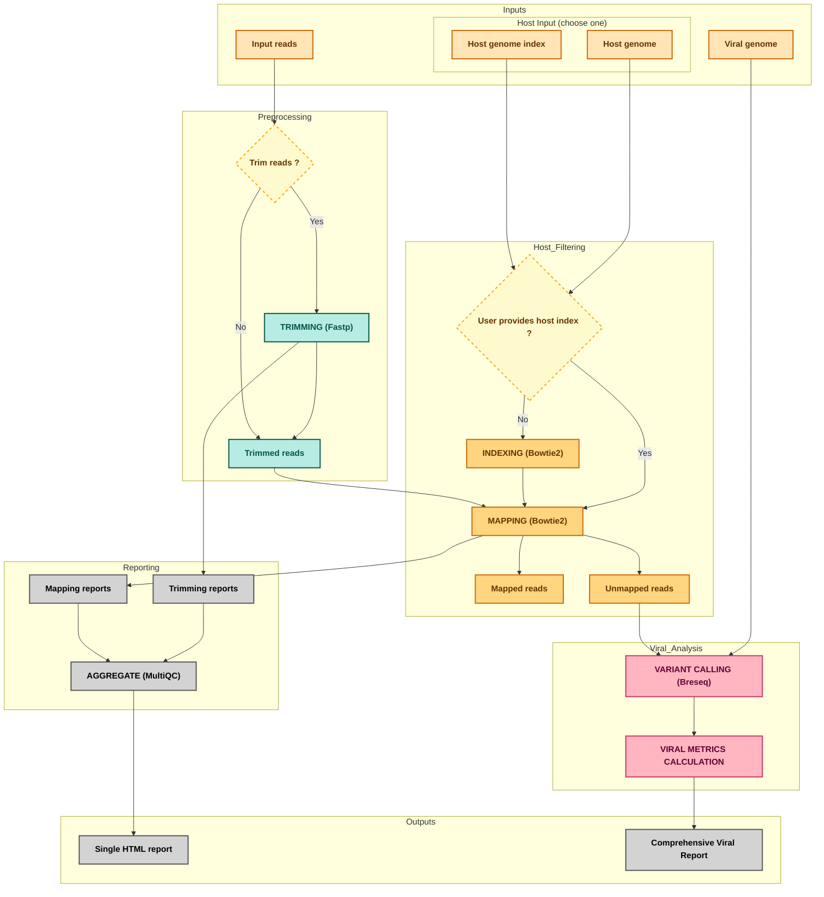

# ViroScan-nf  


**ViroScan-nf** is a Nextflow pipeline designed to separate host and viral reads from sequencing data, identify viral mutations, and compute viral alignment and coverage metrics.

The pipeline combines host read filtering, viral variant calling, and summary metric generation in a fully reproducible workflow.

## Table of Contents

   * [Foreword](#foreword)
   * [Installation](#installation)
   * [Usage](#usage)
   * [Parameters](#parameters)
   * [Outputs](#outputs)
   * [Uninstall](#uninstall)
   * [Contributing](#contributing)
   * [Report bugs and issues](#report-bugs-and-issues)
   * [Acknowledgement](#acknowledgement)

## Foreword

ViroScan-nf is an automated pipeline that:
- Filters out host reads by aligning sequencing reads against a host reference genome using Bowtie2
- Retains unmapped reads and uses them as candidate viral reads
- Aligns viral reads to a viral reference genome using breseq
- Identifies viral mutations
- Computes viral alignment and coverage metrics directly from breseq outputs

**Pipeline overview** :



## Installation

**Requirements**
  * [Nextflow](https://www.nextflow.io/) ≥ 22.04.0
  * [Docker](https://www.docker.com) or [Singularity](https://sylabs.io/singularity/) 
  * [Java](https://www.java.com/en/) ≥ 11

**ViroScan-nf**

```bash
# clone the workflow repository
git clone https://github.com/srh-bzd/ViroScan-nf.git

# cd into the repository
cd ViroScan-nf
```

**Nextflow** 

You can install Nextflow either via conda (recommended) or manually.

  * Using conda 

      ```bash
      conda create -n nextflow
      conda activate nextflow
      conda install nextflow
      ```

  * Manual installation

      ```bash
      # Make sure 11 or later is installed on your computer by using the command:
      java -version
      
      # Install Nextflow by entering this command in your terminal(it creates a file nextflow in the current dir):
      curl -s https://get.nextflow.io | bash 
      
      # Add Nextflow binary to your user's PATH:
      mv nextflow ~/bin/
      # OR system-wide installation:
      # sudo mv nextflow /usr/local/bin
      ```

**Container platform**

You must use Docker or Singularity.
- Docker: https://docs.docker.com/desktop/
- Singularity: https://docs.sylabs.io/guides/latest/admin-guide/installation.html

## Usage

Display available options:
```bash
nextflow run main.nf --help
```

Before running the workflow, make sure that the Python script used for generating viral metrics is executable:

```bash
chmod +x bin/write_viral_table.py
```

Run the pipeline using Docker:
```bash
nextflow run main.nf \
    -profile docker,local \
    --reads 'data/*R{1,2}.fq.gz' \
    --host_genome host.fasta \
    --viral_genome virus.gbk
```

Run the pipeline on the test dataset:
```bash
nextflow run main.nf \
    -profile docker,local,test
```

Available profiles:
- `docker`
- `singularity`
- `local`
- `ifb`

## Parameters

**Mandatory parameters**

| Parameter        | Description                            |
| ---------------- | -------------------------------------- |
| `--reads`        | Input reads                            |
| `--host_genome`  | Host reference genome (FASTA)          |
| `--viral_genome` | Viral genome (FASTA or GenBank)        |
| `--outdir`       | Output directory                       |

**Optional parameters**

| Parameter             | Default | Description                                         |
| --------------------- | ------- | --------------------------------------------------- |
| `--paired_end`        | true    | Paired-end or single-end reads                      |
| `--host_genome_index` | null    | Prefix of an existing Bowtie2 index (skip indexing) |
| `--run_fastp`         | true    | Enable read trimming                                |
| `--fastp_options`     | ""      | Additional fastp options                            |
| `--bowtie2_options`   | ""      | Additional Bowtie2 options                          |
| `--breseq_options`    | ""      | Additional breseq options                           |
| `--table_threshold`   | 5       | Minimum percentage of reads aligned to the viral genome required to include the sample in the viral metrics table|
| `--help`              | false   | Display help message                                |

## Outputs

The main results are written to the directory specified by `--outdir`.

```bash
results/
├── 01.cleaned_reads
│   ├── log
│   │   └── sample_fastp.html
│   └── sample_R*.fastq.gz
├── 02.indexed_ref
│   ├── host.*.bt2
│   └── host.rev.*.bt2
├── 03.aligned_reads
│   ├── host
│   │   ├── log
│   │   │   └── sample_bowtie2.log
│   │   ├── sample.bam
│   │   ├── sample_matched.fq.gz
│   │   └── sample_matched_R*.fq.gz
│   └── viral
│       ├── sample.bam
│       └── sample.bam.bai
├── 04.unmapped_reads
│   ├── host
│   │   ├── sample_unmatched.fq.gz
│   │   └── sample_unmatched_R*.fq.gz
│   └── viral
│       ├── sample_R*.unmatched.fastq
│       └── sample.unmatched.fastq
├── 05.called_variants
│   ├── sample
│   │   └── output
│   │       ├── calibration
│   │       ├── evidence
│   │       ├── index.html
│   │       ├── log.txt
│   │       ├── marginal.html
│   │       ├── output.done
│   │       ├── output.gd
│   │       ├── output.vcf
│   │       ├── summary.html
│   │       └── summary.json
│   └── viral_alignment_metrics.txt
└── multiqc_report.html
```

**Viral metrics table**

Generated from `breseq summary.json`. Example: 
| Sample_ID | Viral_genome | Num_reads | Num_reads_aligned | Percent_reads_aligned | Avg_coverage | Percent_coverage | Num_bases_mapped | Num_genes | Num_features | Coverage_variance |
|-----------|--------------|-----------|-----------------|--------------------|--------------|----------------|-----------------|-----------|--------------|-----------------|
| sample    | OR669303     | 8984      | 8740            | 97.3               | 165          | 100             | 1309237         | 8         | 10           | 660.3331        |


| Column                    | Description                                                  |
| ------------------------- | ------------------------------------------------------------ |
| **Sample_ID**             | Name of the sample being analyzed                            |
| **Viral_genome**          | Viral reference genome ID used for alignment                 |
| **Num_reads**             | Total number of input sequencing reads                       |
| **Num_reads_aligned**     | Number of reads that aligned to the viral genome             |
| **Percent_reads_aligned** | Percentage of reads aligned to the virus                     |
| **Avg_coverage**          | Average sequencing coverage across the viral genome          |
| **Percent_coverage**      | Approximate percentage of the genome covered by reads        |
| **Num_bases_mapped**      | Total number of bases mapped to the viral genome             |
| **Num_genes**             | Number of viral genes detected                               |
| **Num_features**          | Number of genomic features detected                          |
| **Coverage_variance**     | Variability of coverage along the viral genome               |


## Uninstall

No installation is required.
To uninstall, simply delete the repository directory.

## Contributing

Contributions are welcome. 
See [Contributing guidelines](https://github.com/srh-bzd/ViroScan-nf/blob/main/CONTRIBUTING.md)

## Report bugs and issues

Please open an issue on GitHub:
https://github.com/srh-bzd/ViroScan-nf/issues

## Acknowledgement

Jacques Dainat (@Juke34)  
Based on the **BiTeN template**: https://github.com/Juke34/BiTeN
